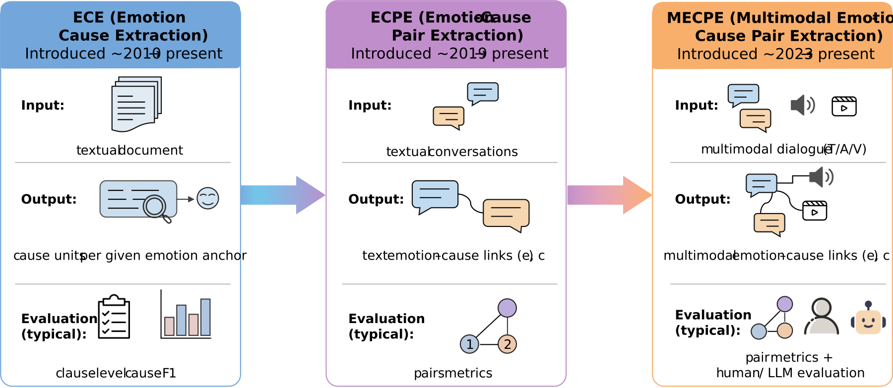
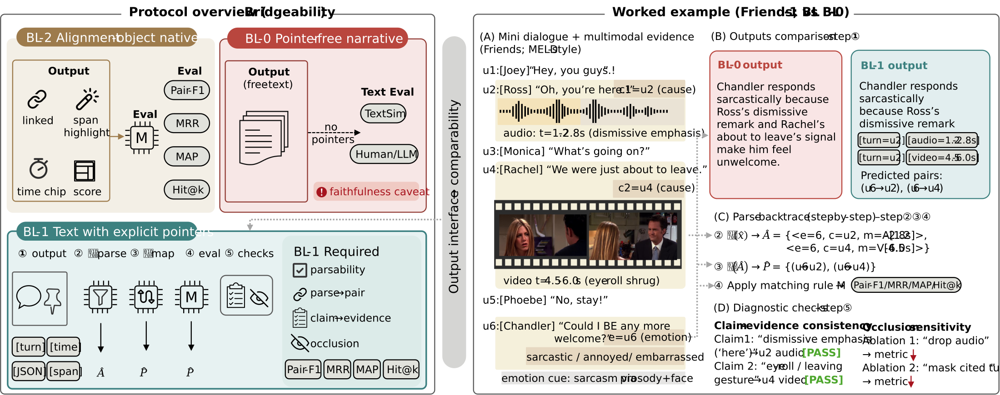
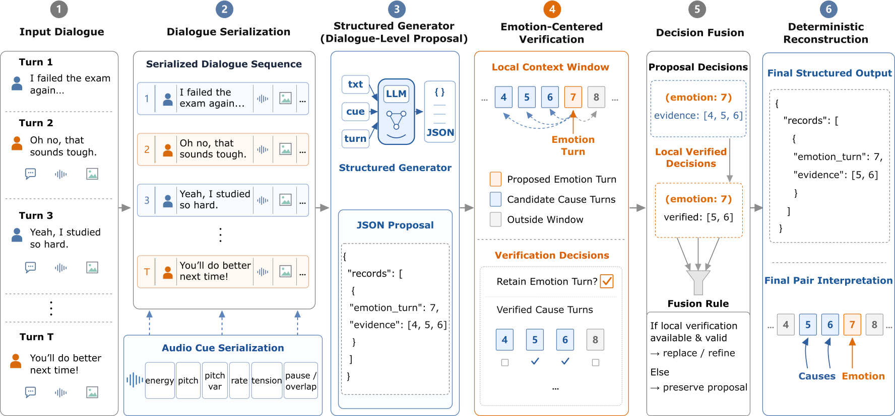

# BridgeProt: Structured Generative ECPE and Parse-Back Evaluation Toolkit

BridgeProt is a structured generative toolkit for **Emotion-Cause Pair Extraction (ECPE)** in conversations. It supports structured prediction, output validation, deterministic conversion from generated records to emotion-cause pair sets, and reproducible evaluation under standard ECPE metrics.

The repository is designed for researchers who want to:

* run structured generative ECPE experiments;
* compare free-form generation with explicit pair prediction;
* validate whether model outputs follow a parseable schema;
* convert structured outputs into turn-indexed emotion-cause pairs;
* report pair metrics and structural validity separately;
* inspect how output format affects evaluation reliability.

Dataset files are not distributed with this repository. Users should place datasets under `BRIDGEPROT_DATA_ROOT` or another configured path after obtaining them from the original dataset providers.

---

## Overview

Emotion-Cause Pair Extraction aims to identify emotional utterances and their corresponding cause utterances from dialogue turns. Standard ECPE evaluation is usually based on explicit turn-indexed emotion-cause pairs.

Generative models can produce flexible natural-language explanations, but free-form outputs are often difficult to align with the exact pair objects required by ECPE scoring. BridgeProt addresses this mismatch by representing predictions as structured records. Each record contains an emotion turn and a sorted, duplicate-free list of evidence turns.

A typical structured output is:

```json
{
  "records": [
    {
      "emotion_turn": 7,
      "evidence": [5, 6],
      "explanation": "Turns 5 and 6 provide the immediate trigger for the emotional reaction in turn 7."
    }
  ]
}
```

Only the decision fields are used for official ECPE scoring:

* `emotion_turn`: the dialogue turn where the emotion is expressed;
* `evidence`: the cause turn or turns supporting that emotion.

The optional `explanation` field is treated as an auxiliary readability channel. It does not change the scored pair decision.

This separation allows BridgeProt to evaluate two different properties:

1. **Decision correctness**: whether the predicted emotion-cause pairs match the reference pairs.
2. **Structural validity**: whether the generated output is valid, parseable, and convertible into the required pair set.

The figure below summarizes the shift from clause-level emotion-cause extraction to multimodal emotion-cause pair extraction. As inputs evolve from textual documents to multimodal dialogues, the audit surface also changes from clauses to explicit links and multimodal evidence units.



---

## What This Repository Provides

BridgeProt includes:

* structured output schemas for ECPE prediction;
* schema validation and normalization utilities;
* dialogue serialization utilities for text, audio, and video settings;
* structured proposal generation;
* emotion-centered verification;
* schema-preserving reconstruction;
* deterministic conversion from records to emotion-cause pair sets;
* matched free-form generation baselines;
* ECPE metric reporting;
* telemetry for structural validity and output usability;
* dataset adapters for public ECPE benchmarks.

The repository can be used either as a structured ECPE method implementation or as a general reference implementation for evaluating parseable generative outputs against explicit pair-based ECPE targets.

---

## Output Interface

BridgeProt focuses on the evaluation interface between generated model outputs and explicit ECPE pair scoring.

Three output styles are useful to distinguish:

| Output style         | Description                                                             | Evaluation implication                                            |
| -------------------- | ----------------------------------------------------------------------- | ----------------------------------------------------------------- |
| Free-form text       | Natural-language explanation without reliable turn pointers             | Readable, but difficult to score directly as ECPE pairs           |
| Pointer-bearing text | Explanation with explicit turn IDs, spans, or time windows              | Can be parsed into turn/span/time evidence fields if a grammar is declared |
| Structured records   | Native record format with explicit `emotion_turn` and `evidence` fields | Directly convertible into pair sets for ECPE scoring              |

BridgeProt uses the structured-record interface by default. This makes the evaluated decision object stable, while still allowing natural-language explanations to be attached as auxiliary information when needed.

The protocol view below illustrates why the output interface matters. Pointer-free narratives can be readable but hard to score, while pointer-bearing and structured outputs support deterministic parse-back, pair-level scoring, and evidence-tied diagnostics.



---

## Method

BridgeProt consists of three main stages.

### 1. Dialogue-Level Proposal

The model reads the serialized dialogue and generates candidate emotion-cause records. Unlike free-form generation, the proposal is already expressed in a structured format that can be validated and converted into pair predictions.

Each record contains:

* `emotion_turn`: the predicted emotion-bearing turn;
* `evidence`: the predicted cause turn or turns.

### 2. Emotion-Centered Verification

For each proposed emotion turn, BridgeProt builds a local verification context and checks whether the proposed causes should be retained, revised, or rejected.

This stage is intended to reduce nearby-context confusion and to make the final pair decision less dependent on a single unconstrained generation step.

### 3. Structured Reconstruction

After verification, BridgeProt reconstructs the final output as a normalized JSON object.

The reconstruction process ensures:

* valid JSON structure;
* valid turn indices;
* ascending order of emotion turns;
* sorted and duplicate-free evidence lists;
* deterministic conversion to emotion-cause pair sets;
* stable evaluation under ECPE metrics.

The decision-only format is recommended as the default setting for official ECPE scoring. The explanation-augmented format is available for analysis of readability and explanation consistency, but the explanation field is not used as a task label.

---

## Framework

The overall BridgeProt framework includes:

1. multimodal dialogue serialization;
2. structured proposal generation;
3. emotion-centered local verification;
4. decision fusion;
5. schema-preserving reconstruction;
6. pair-set conversion and metric reporting.



---

## Parse-Back and Evaluation

BridgeProt makes the parse-back path explicit:

```text
generated output
    → schema validation
    → normalized records
    → emotion-cause pair set
    → ECPE metrics
```

For a structured output `y`, the predicted pair set is:

```text
{(emotion_turn, cause_turn) | cause_turn ∈ evidence}
```

For example:

```json
{
  "records": [
    {
      "emotion_turn": 7,
      "evidence": [5, 6]
    }
  ]
}
```

is converted into:

```text
(7, 5), (7, 6)
```

BridgeProt reports structural validity separately from ECPE decision metrics. This prevents invalid or unparsable generation from being mixed with pair prediction accuracy.

Typical reported quantities include:

* Emotion Precision / Recall / F1;
* Cause Precision / Recall / F1;
* Pair Precision / Recall / F1;
* structural validity;
* parse success rate;
* output normalization status;
* optional free-form baseline recovery statistics.

---

## Datasets

Experiments are supported on three public multimodal ECPE benchmarks:

| Dataset | Language | Modalities         | Description                           |
| ------- | -------- | ------------------ | ------------------------------------- |
| ECF     | English  | Text, Audio, Video | English conversational ECPE benchmark |
| MEC4    | Chinese  | Text, Audio, Video | Chinese multimodal ECPE benchmark     |
| MECAD   | Chinese  | Text, Audio, Video | Multi-scenario Chinese ECPE benchmark |

Dataset sources:

| Dataset | Paper                                                                                                                        | Dataset / GitHub                                                                                         |
| ------- | ---------------------------------------------------------------------------------------------------------------------------- | -------------------------------------------------------------------------------------------------------- |
| ECF     | Multimodal Emotion-Cause Pair Extraction in Conversations                                                                    | [NUSTM/MECPE](https://github.com/NUSTM/MECPE), [Hugging Face](https://huggingface.co/datasets/NUSTM/ECF) |
| MEC4    | Emotion across Modalities and Cultures: Multilingual Multimodal Emotion-Cause Analysis with Memory-Inspired Framework        | [DanWu2003/M3F-MECPE](https://github.com/DanWu2003/M3F-MECPE)                                            |
| MECAD   | M3HG: Multimodal, Multi-scale, and Multi-type Node Heterogeneous Graph for Emotion Cause Triplet Extraction in Conversations | [redifinition/M3HG](https://github.com/redifinition/M3HG)                                                |

This repository does not redistribute third-party datasets, raw videos, audio files, or annotations. Please download each dataset from its original source and follow the corresponding license and usage terms.

Four modality settings are supported:

| Setting | Description          |
| ------- | -------------------- |
| T       | Text only            |
| T+A     | Text + Audio         |
| T+V     | Text + Video         |
| T+A+V   | Text + Audio + Video |

---

## Reference Results

The following results are provided as reference runs for checking the repository setup and reproducing the structured-output evaluation pipeline. They should be interpreted under the stated dataset, split, modality, backbone, and evaluation protocol. They are not intended as a universal cross-benchmark leaderboard.

### Comparison with Published ECPE Systems

| Dataset | System       | Best Modality | Emotion F1 | Cause F1 | Pair F1 |
| ------- | ------------ | ------------- | ---------- | -------- | ------- |
| ECF     | MECPE-2steps | T+A           | 79.17      | 70.27    | 53.48   |
| ECF     | HiLo         | T+A+V         | 79.35      | 72.28    | 55.45   |
| ECF     | BridgeProt   | T+A           | 73.94      | 72.35    | 54.55   |
| MEC4    | MECPE-2steps | T+A           | —          | —        | 28.82   |
| MEC4    | HiLo         | T+A+V         | —          | —        | 35.11   |
| MEC4    | M³F          | T+A+V         | —          | —        | 44.79   |
| MEC4    | BridgeProt   | T+A+V         | 67.23      | 58.63    | 42.65   |
| MECAD   | SHARK        | T             | 68.14      | 65.24    | 45.74   |
| MECAD   | M³HG         | T             | 70.02      | 68.12    | 50.27   |
| MECAD   | BridgeProt   | T+A           | 77.54      | 74.67    | 57.89   |

These numbers position BridgeProt among representative ECPE systems under the reported settings. Because published systems may differ in implementation details, modality handling, and protocol assumptions, the table should be read as benchmark positioning rather than controlled component evidence.

### Structured Output vs. Free-Form Generation

The following table compares matched free-form generation and structured BridgeProt outputs under the same backbone, training regime, and evaluation setting. The purpose is to illustrate how explicit structured outputs affect pair recovery and structural validity under matched settings.

| Dataset | Setting | Free-form Pair F1 | BridgeProt Pair F1 | BridgeProt Validity |
| ------- | ------- | ----------------- | ------------------ | ------------------- |
| ECF     | 0-shot  | 0.11              | 26.25              | 100.00              |
| ECF     | 3-shot  | 0.52              | 41.10              | 100.00              |
| ECF     | LoRA    | 1.88              | 50.76              | 100.00              |
| ECF     | SFT     | 1.37              | 52.77              | 100.00              |
| MEC4    | 0-shot  | 0.56              | 14.54              | 100.00              |
| MEC4    | 3-shot  | 0.82              | 18.78              | 100.00              |
| MEC4    | LoRA    | 0.47              | 40.05              | 100.00              |
| MEC4    | SFT     | 2.37              | 42.65              | 100.00              |
| MECAD   | 0-shot  | 0.45              | 31.14              | 100.00              |
| MECAD   | 3-shot  | 6.72              | 40.47              | 100.00              |
| MECAD   | LoRA    | 5.08              | 47.07              | 100.00              |
| MECAD   | SFT     | 2.97              | 50.50              | 100.00              |

These results illustrate the operational effect of aligning generation with the explicit emotion-cause pair object required by ECPE evaluation.

---

## Repository Structure

```text
BridgeProt/
├── README.md
├── requirements.txt
├── LICENSE
├── figures/
│   ├── bp_protocol_case.png
│   ├── evolution_landscape.png
│   └── framework.png
├── configs/
│   ├── paths.py
│   └── bridgeprot/
│       ├── base.yaml
│       ├── inference/
│       └── train/
├── core/
│   ├── config.py
│   ├── prompts.py
│   ├── runner.py
│   ├── schema.py
│   ├── validator.py
│   └── ...
├── data/
│   ├── adapters/
│   ├── registry.py
│   ├── schema.py
│   ├── targets.py
│   └── sft_dataset.py
├── freeform/
│   ├── parser.py
│   ├── prompts.py
│   └── runner.py
├── methods/
│   ├── fewshot.py
│   ├── stage2.py
│   ├── staged.py
│   └── training.py
├── retrieval/
│   ├── bank.py
│   └── selectors.py
├── scripts/
│   ├── run_bridgeprot.py
│   ├── run_bridgeprot_freeform.py
│   ├── train_bridgeprot.py
│   └── train_bridgeprot_freeform.py
├── evaluation/
│   └── bridgeprot_telemetry.py
└── utils/
```

The release uses a flat project layout. There is no nested `bridgeprot/` package directory. Import paths are rooted at the repository directory, for example:

```python
from core.config import ...
from methods.staged import ...
from data.registry import ...
```

---

## Reproducibility Checklist

Before running experiments, check the following:

* [ ] `requirements.txt` is installed with a compatible CUDA/PyTorch stack.
* [ ] `BRIDGEPROT_DATA_ROOT` points to the dataset directory.
* [ ] `BRIDGEPROT_OUTPUT_ROOT` points to the output directory.
* [ ] Dataset files follow the expected adapter format.
* [ ] The selected dataset shortcut is one of `ecf`, `mec4`, or `mecad`.
* [ ] The selected modality setting is supported.
* [ ] The structured output schema is enabled.
* [ ] Output validation is active.
* [ ] Pair metrics and validity telemetry are saved.
* [ ] Free-form baselines are run with the matched backbone and setting if comparison is required.

---

## Usage

Install dependencies with the CUDA/PyTorch stack that matches your environment:

```bash
pip install -r requirements.txt
```

Set the dataset and output roots:

```bash
export BRIDGEPROT_DATA_ROOT=/path/to/datasets
export BRIDGEPROT_OUTPUT_ROOT=/path/to/outputs
```

The release configuration supports the following dataset shortcuts:

```text
ecf
mec4
mecad
```

Run structured BridgeProt inference:

```bash
python scripts/run_bridgeprot.py --dataset ecf --stage1-method zeroshot
```

Run a few-shot setting:

```bash
python scripts/run_bridgeprot.py --config configs/bridgeprot/inference/ecf_fewshot.yaml
```

Train supervised BridgeProt:

```bash
python scripts/train_bridgeprot.py --dataset ecf --method sft
```

Run the matched free-form baseline:

```bash
python scripts/run_bridgeprot_freeform.py --dataset ecf --method zeroshot
```

Inference uses vLLM and requires a visible NVIDIA GPU. Training uses the TRL/Unsloth stack and may require environment-specific installation choices.

---

## Notes on Evaluation

BridgeProt separates output validity from task accuracy.

A valid structured output is one that:

* is valid JSON;
* follows the required schema;
* contains valid turn indices;
* has sorted and duplicate-free evidence lists;
* can be converted into an explicit pair set.

Task accuracy is then computed from the recovered pair set using the official ECPE evaluation protocol.

This distinction is important because a model can produce fluent text that is hard to score, or produce valid structure with incorrect pair decisions. BridgeProt reports these aspects separately.

---

## Citation

If you use this repository before a formal citation is available, please cite the repository URL and the commit hash used in your experiments. A formal citation entry will be added when available.

---

## License

This project is released under the MIT License. See LICENSE for details.
